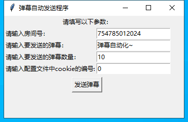
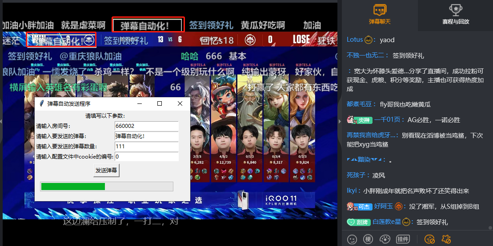
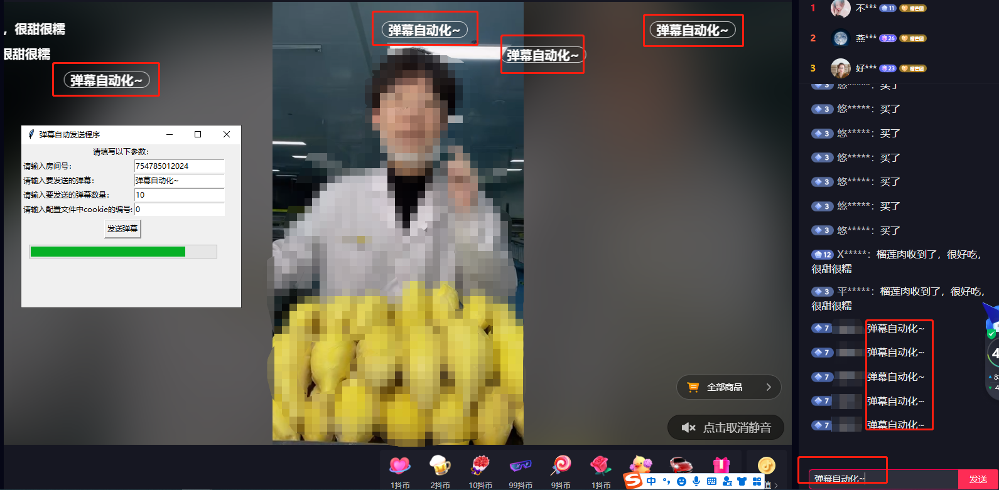

# 弹幕自动发送小程序
---
### 环境配置
    安装chrome浏览器

### 使用方法
* 
* 配置好上述环境后 双击main.exe 打开软件界面
* 在输入框里分别输入房间号、要发送的弹幕、发送弹幕的数量、以及配置文件中cookie的编号（cookie获取方式最简单的就是在chrome中打开F12，网络过滤文档资源，搜到http头的cookie）
* 配置文件config.json中有一个cookie键，将自己浏览器中的cookie值复制保存在配置文件对应键下
* 默认是虎牙直播间，如果要换成抖音直播间，可以把配置文件config-douyin.json替换成config.json
* 输入完软件界面里的参数后，点击发送按钮，即可运行程序发送弹幕（这里要注意的一点就是，虎牙直播间连续发送五个弹幕后就会限制你的发送20秒左右）
* 虎牙直播间效果：
* 
* 抖音直播间效果：
* 
* 关于python生成exe文件的方法，可以用pip直接安装pyinstaller.exe，但win11在环境变量中干掉了python以至于跳转到microstore，只需要调整PATH中python安装路径的优先级顺序，或者直接：
  * C:\Users\Administrator\AppData\Local\Programs\Python\Python39\Scripts\pyinstaller.exe -F -w -i 1.ico main.py
* 更多其他平台的直播间的开发，感兴趣加微信交流：loboism
        
